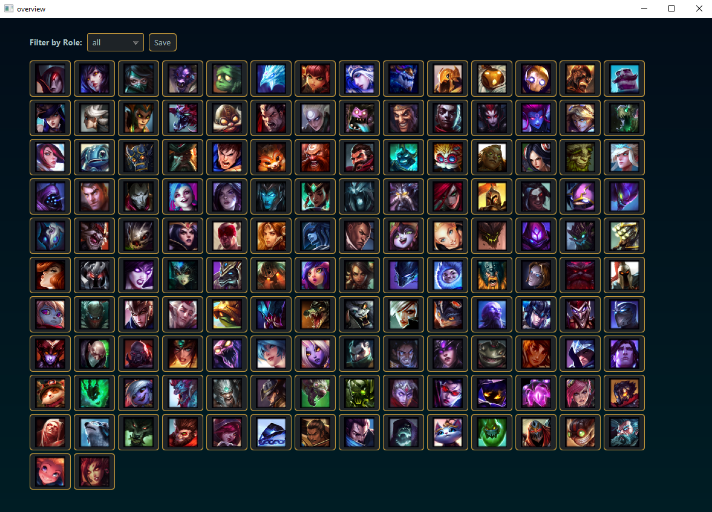
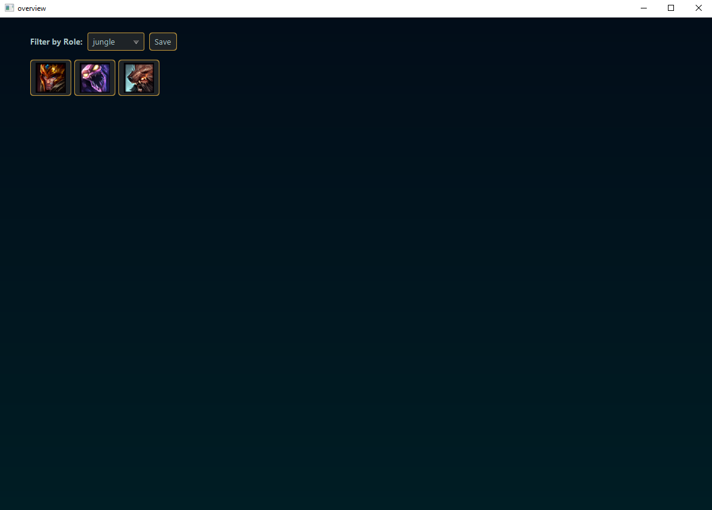
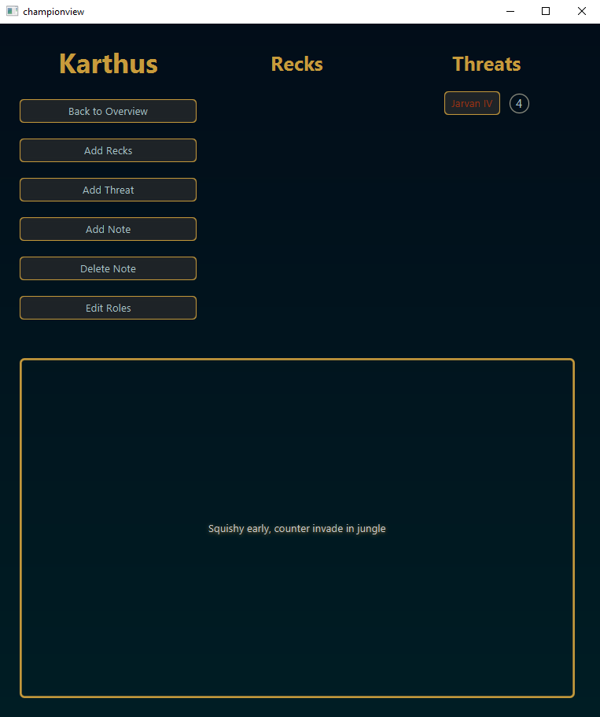

# League of Legends Helper

An application to help you keep note of Champion Interactions and your Champion Pool.

# Showcase

Overview of all champions

Selecting current role (jungle) to see your selected main champion pool.
This can help you visualize and weigh your options

When Selecting a champion you can take notes and add its strength compared to other champions

Includes state-of-the-art animations!

